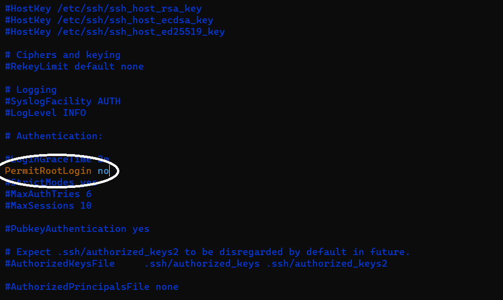

# Assignment 3


# Step 1: Creating a new regular user

We can create a regular user by the command below in the linux terminal

(replace the username with your desired name):

```bash
adduser <username>
```
To allow the user to use admin priviliges we can add them to the sudo group by using the command:

(replace the username with your desired name):

```bash
usermod -aG sudo <username>
```


To log in your newly created user, we need to exit out of the root user first by using the command:

```bash
exit
```

To log in as the user, we can use the command:

(replace the command with your username and server ip)


```bash
ssh -i .ssh/do-key username@server-ip
```


# Step 2: Prevent the root user from connecting via SSH

To prevent the root user from logging in the server we need to configure the **sshd_config** file

```bash
sudo vim /etc/ssh/sshd_config
```

Scroll through the file until you find the "**PermitRootLogin**" option. Set the option to **no**

```bash
PermitRootLogin no
```



To save and close the file, use the command in vim:
```bash
:wq
```

We will need to restart the server by using the command:

```bash
sudo systemctl restart ssh
```

# Step 3: Install nginx
We Fist need to check for any package updates availabe using:

```bash
sudo apt update
```
We can install nginx by using the command:

```bash
sudo apt install nginx
```
Before creating the site, we should check the status of nginx

```bash
sudo apt install nginx
```

We can start nginx by using the command:

```bash
sudo systemctl start nginx
```

After starting, we also need to enable to nginx with the command:

```bash
sudo systemctl enable nginx
```


# Step 4: Configure nginx to serve a sample website

Start by making a folder for the site:

```bash
sudo mkdir /etc/nginx/sample-site
```

To display the sample HTML we will create a index.html inside the created folder:

```bash
sudo vim /etc/nginx/sample-site/index.html
```

To exit and save the file, we can use the command:
```bash
:wq
```

We will use this sample html:

```HTML
<!DOCTYPE html>
<html lang="en">
<head>
    <meta charset="UTF-8">
    <meta name="viewport" content="width=device-width, initial-scale=1.0">
    <title>2420</title>
    <style>
        body {
            display: flex;
            align-items: center;
            justify-content: center;
            height: 100vh;
            margin: 0;
        }
        h1 {
            text-align: center;
        }
    </style>
</head>
<body>
    <h1>Hello, World</h1>
</body>
</html>
```


We will make a .conf server block file for site using the command:
```bash
sudo vim /etc/nginx/sites-available/sample-site.conf
```


Sample Server Block:

```
server {
	listen 80;
	
	root /var/www/sample-site;
	
	index index.html index.htm index.nginx-debian.html;
	
	server_name _;
	
	location / {
		# First attempt to serve request as file, then
		# as directory, then fall back to displaying a 404.
		try_files $uri $uri/ =404;
	}
}
```

To exit and save the file, we can use the command:
```bash
:wq
```

CD to the enabled sites folder
```bash
cd /etc/nginx/sites-enabled/
```
Once you are in the folder, Remove the default file using the command:
```bash
sudo unlink default
```

To enable the site, we will create a symbolic link to the .conf file using the command:
```bash
sudo ln -s /etc/nginx/sites-available/sample-site /etc/nginx/sites-enabled/
```

To connect to the newly created site, we can use the command:

(Replace the text with the ip address to your server)
```
http://ip-to-server
```
